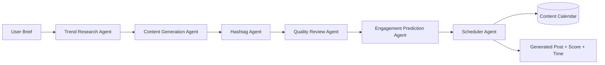

# Architecture

## 1. System overview

```
┌─────────────────────────────────────────────────────────────────┐
│                         BROWSER (client)                        │
│                                                                   │
│   index.html  ── loads ──▶  style.css                           │
│                ── loads ──▶  mockData.js                        │
│                ── loads ──▶  agents.js                          │
│                ── loads ──▶  charts.js                           │
│                ── loads ──▶  app.js                               │
│                                                                   │
│   ┌───────────────┐     user brief      ┌────────────────────┐  │
│   │ Content        │ ───────────────▶  │  runPipeline()      │  │
│   │ Generator page │ ◀─────────────── │  (agents.js)         │  │
│   └───────────────┘   rendered result   └──────────┬─────────┘  │
│                                                      │            │
│                                       calls agents in sequence   │
│                                                      ▼            │
└─────────────────────────────────────────────────────────────────┘
```

There is no server in this build — `runPipeline()` runs entirely client-side using mock logic and timed delays to simulate agent "thinking" time. This keeps the project runnable with zero setup while preserving the exact same orchestration pattern a real backend would use.

## 2. Agent pipeline (data flow)

```
   User brief
 (niche, audience,
  platform, tone)
        │
        ▼
┌───────────────────┐   trending topics + relevance score
│ 1. Trend Research  │ ─────────────────────────────────────┐
│    Agent           │                                       │
└───────────────────┘                                        ▼
                                                    ┌───────────────────┐
                                                    │ 2. Content         │
                                                    │    Generation      │
                                                    │    Agent           │
                                                    └─────────┬──────────┘
                                                               │ draft post
                                                               ▼
                                                    ┌───────────────────┐
                                                    │ 3. Hashtag Agent   │
                                                    └─────────┬──────────┘
                                                               │ tags
                                                               ▼
                                                    ┌───────────────────┐
                                                    │ 4. Quality Review  │
                                                    │    Agent           │
                                                    └─────────┬──────────┘
                                                               │ quality score
                                                               ▼
                                                    ┌───────────────────┐
                                                    │ 5. Engagement      │
                                                    │    Prediction      │
                                                    │    Agent           │
                                                    └─────────┬──────────┘
                                                               │ engagement score
                                                               ▼
                                                    ┌───────────────────┐
                                                    │ 6. Scheduler Agent │
                                                    └─────────┬──────────┘
                                                               │
                                                               ▼
                                                    Scheduled post + recommended time
                                                    → shown in Content Generator
                                                    → placeable on Content Calendar
```

Each stage receives the accumulated output of the previous stages (see `runPipeline()` in `agents.js`), mirroring how a real multi-agent system would pass structured context forward — for example, the Engagement Prediction Agent reads the Quality Review Agent's score to help shape its own estimate.

## 3. Mermaid version (renders on GitHub / most Markdown viewers)



## 4. UI ↔ logic mapping

| UI element | Backing function(s) in code |
|---|---|
| Landing hero pipeline animation | `animateHeroPipelineLoop()`, `buildPipelineSvg()` in `app.js` |
| Dashboard stat cards / lists | `renderDashboard()` in `app.js`, seed data in `mockData.js` |
| Dashboard charts | `initDashboardCharts()` in `charts.js` |
| Content Generator form submit | `bindGeneratorForm()` → `runPipeline()` → `renderGeneratorResult()` |
| Agent Monitor "Run pipeline" | `bindRunPipelineButton()` → `runPipeline()` → `setAgentCardState()` / `setPipelineNodeState()` |
| Content Calendar drag-and-drop | `renderDrafts()`, `renderCalendarGrid()` using native HTML5 Drag and Drop events (`dragstart`, `dragover`, `drop`) |

## 5. Why no framework/backend

This is intentional for a beginner-friendly, easily-graded college project:
- **No build step** — anyone can open `index.html` directly.
- **No dependencies to install** — the only external resources are two CDN links (Google Fonts, Chart.js).
- **Readable, linear code** — plain functions and DOM calls instead of framework abstractions, so the agent logic is the focus, not tooling.

The `docs`/README explain exactly how to replace each mock function with a real API call when moving beyond the classroom demo.
